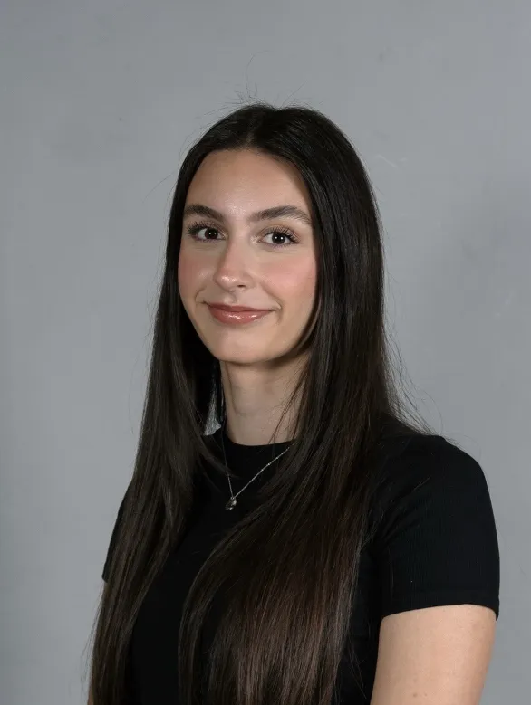

# About Us

## Rachel Dalton: 

Rachel is interested in expanding her skills and gaining expertise in artificial intelligence. She has experience 
creating virtual reality games for research purposes using Unity and C#. She has also completed a 16-month internship at
Seequent, where she developed her C++ skills creating desktop software for geoscientists and engineers. Passionate about
learning and professional growth, she is looking forward to this project which will allow her to expand her skillset and
technical knowledge. 

## Tamunomiete (Tammy) Brown: 

Tammy has an interest in Technology, AI and using programming to optimize processes. She has experience working on 
projects in various programming languages and most recently completed a 16-month internship where she worked with the 
projects team in optimizing business processes and automating manual workflow using Microsoft Power Platform. Tammy is 
looking to expand her current skill set and develop her programming skills.

## Sobia Khan:

Sobia is interested in learning more about the development of artificial intelligence. She has experience with training 
machine learning algorithms to remove artifacts and increase the resolution of brain MRI’s. She has experience making 
applications and websites in multiple programming languages. She completed a 16-month internship at Computer Modelling 
Group where she did quality assurance and created automated tests in C# and python for the reservoir simulation software.

## Saina Ghasemian-Roudsari: 

Saina is passionate about expanding her expertise in artificial intelligence models, focusing on training and 
fine-tuning them for specialized applications. She has extensive experience working on various C++ projects and has 
completed two internships: a 4-month position at Markanyx and an 8-month role at Symend. At Markanyx, she enhanced her 
front-end development skills using PHP and SQL. During her internship at Symend, she gained proficiency in C# .NET and 
worked on code generation using Liquid template language and YAML to build features for the company's app.

## Jana Afifi: 

Jana has a strong interest in Artificial Intelligence (AI) and a broad range of coding experience. During her 16-month 
internship at TC Energy/South bow as a Liquid SCADA Intern, she worked with Visual Basic to maintain and optimize 
critical control systems for liquid pipelines. This role gave her hands-on experience with industrial automation, which, 
combined with her passion for AI, fuels her drive to explore innovative solutions in technology.

## Jack Barrie: 

Jack is interested in cloud engineering, AI, and data analytics. He has experience in LLMs through personal projects and 
freelance work. During his 16-month internship at DESTINE Health, he learned C# and .NET to maintain the company's 
existing codebase. Then he updated and rewrote the web application using NextJS and Go, giving the application a more 
modern look, and improving speed. 